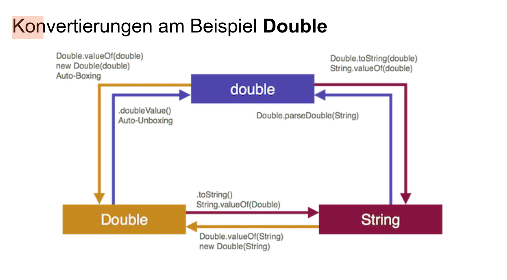

<div style="font-family:Papyrus; font-size:2em;">
    
# Tips & Tricks

## Git Befehle
```bash
git add .
git commit -m "Nachricht"
git push

// 

git pull
```
## switch
```java
switch(expression) {
  case x:
    // code block
    break;
  case y:
    // code block
    break;
  default:
    // code block
}
```

## Collections


### Lists, Sets
```java
Iterator<String> iterator = list.iterator();
while(iterator.hasNext()) {
    System.out.println(iterator.next());
}

for (String s : list) {
    System.out.println(s);
    }
```

* Arrays.asList wandelt einen Array in eine veränderliche List um
* List.of() erzeugt eine unveränderliche Liste 

## Wrapper
wandeln primitive Datentypen in Objekte um (zB um sie in Collections zu speichern)


### Maps
```java
Map<K, V> map = new HashMap<>();
map.put(K key, V value);
map.get(K key);
Set<K> keys = map.keySet();                  // Menge aller Schluessel
Collection<V> values = map.values();         // Collection aller Werte
Set<Map.Entry<K, V>> entries = map.entrySet();  // Menge aller Schluessel-Werte-Paare
// Iteration ueber alle Eintraege (Map.Entry) der Map
for(Map.Entry<K, V> entry : map.entrySet())
    {
   System.out.println(entry.getKey() + " " + entry.getValue());
    }

```

### Exceptions
Methoden werfen Exeptions, wenn dort Probleme auftreten 
zB.: Division durch 0, Wrapper-Klassen (String in Integer, Double, etc. umwandlen), IndexOutOfBoundException, Datei nicht gefunden, etc.
```java

//bei welcher Methode/Aktion tritt das Problem auf? 
[modifizierer] [rueckgabetyp] fehleranfaelligeAnweisung throws ExceptionType
{
    // Anweisungsblock
    // wirft (evtl.) Exception throw new IllegalSideLengthException();
        if(nenner == 0) {
           throw new ArithmeticException("Division durch 0 nicht erlaubt!");}
}   

//wie behandle ich das Problem, wenn ich die Methode benutze?
try {
    // Anweisungsblock
    fehleranfaelligeAnweisung();
} catch (ExceptionType e) {
    // Behandlung der Exception
        System.out.println("Fehler: " + e.getMessage());
}

//ACHTUNG! NICHT zusammen - entweder wirft Methode Exeption (weiter) oder sie fängt Exeption!
FALSCH (2 in 1, definistion der fehleranfälligen Anweisung + throws Exception + Aufruf ist im try-catch Block)  
public void methode() throws Exception {
    try {
        // ...
        fehleranfaelligeAnweisung();
        // ...
    } catch (Exception e) {
        // ...
    }
}

```

### ENUM
```java
public enum KartenWert {
    SIEBEN(0), ACHT(0), NEUN(0), BUBE(2), DAME(3), KOENIG(4), ZEHN(10), ASS(11);

    private final int wert;

    KartenWert(int wert) {
        this.wert = wert;
    }

    public int getWert() {
        return wert;
    }

}

```
ENUM: auf den Namen zugreifen mit KartenWert.name()

### JUnit-Tests

```java
class PowerTest {
    static Power p1,p2;
    int testnr = 1;

    @BeforeAll
    public static void setup()
    { //given
        p1 = new Power(2,3);
        p2 = new Power(2,3);
    }

    @BeforeEach
    public void printBeforeTests()
    {
        System.out.printf("%n %n --------------- Test %d ------------ %n", testnr);
    }


    @Test
    void testToString() {
        //when
        String s = p1.toString();
        //then
        assertEquals("(2^3)", s, "Strings are not equal!");
    }

    @Test
    public void testEqualsObject() {
        //when
        boolean result = p1.equals(p2); 
        //then
        assertTrue(result, " 2^3 should be equal to 2^3!");
    }
}
```
https://freiheit.f4.htw-berlin.de/prog2/junit/#exceptions-testen
```java
@Test
    void testFakultaetSmallerThan1() 
    {
        // given
        Fakultaet f = new Fakultaet();

        // when
        Exception exception = assertThrows(IllegalArgumentException.class, () ->
        f.fakultaet(0));

        // then
        assertEquals("Zahl muss groesser gleich 1 sein!", exception.getMessage());
    }
```
##### Testideen
* Grenzwerte
* Zahlen: 0, Null (wenn kein Primitiver Datentyp), negative Zahlen, positive Zahlen
* Strings: null, “”, normaler String, String mit Umlauten
* Collections: null, leere Liste/ Map/ Set, Liste mit mehreren Elemeneten (3) anstatt nur einem
##### Faustregeln
* Man sollte wirklich alle Auswirkungen des zu testenden Codes überprüfen.
  * Rückgabewert (wenn es denn einen gibt)
  * Änderungen an Attributen von this
  * Änderungen an Attributen der Parameter
  * Änderungen in statischen Werten
  * Änderungen in externen Daten (Datenbanken, Dateien,…)
* Manchmal lassen sich Attribute nicht direkt prüfen, man kann nur die Auswirkungen in anderen Methoden testen. Passen Sie trotzdem nicht die Klasse an den Test an!
* Kopieren Sie keine Formeln/Berechnungen aus dem zu testenden Code!
  * Rechnen Sie möglichst selbst das korrekte Ergebnis aus.
  * Wenn Sie können, benutzen Sie dabei eine andere Formel, die das gleiche Ergebnis liefern müsste.

##Interface Comparable
Die compareTo Methode vergleicht das aktuelle Objekt mit einem anderen Objekt desselben Typs und gibt ein Integer zurück, das angibt, wie die beiden Objekte zueinander stehen:  
Ein Wert kleiner als 0 bedeutet, dass das aktuelle Objekt kleiner ist als das angegebene Objekt.
Ein Wert von 0 bedeutet, dass beide Objekte gleich sind.
Ein Wert größer als 0 bedeutet, dass das aktuelle Objekt größer ist als das angegebene Objekt.

```java
public class Person implements Comparable<Person> {
    private String name;
    private int age;

    public Person(String name, int age) {
        this.name = name;
        this.age = age;
    }

    @Override
    public int compareTo(Person other) {{
        if (this.age == other.age) {
          return 0;
        } else if (this.age > other.age) {
          return 1;
        } else {
          return -1;
        }
      //weil Integer schon eine natürliche Ordnung haben und Comparable implement geht auch
       // return this.age.compareTo(age.name);
    }
}
``` 

## Streams
Streams bieten die Möglichkeit,Sammeloperationen auf Collections auszuführen, ersetzen also die for- Schleife
Zwischenoperationen haben als Rückgabewert wieder einen Stream, abschließende Operationen einen anderen Datentyp

#### Beispiele für Zwischenoperationen

| Method                                                                                                       | Description                                                                                                                                                      |
|--------------------------------------------------------------------------------------------------------------|------------------------------------------------------------------------------------------------------------------------------------------------------------------|
| `Stream<T> filter(Predicate<? super T> predicate)`                                                           | Gibt einen Stream der Elemente zurück, auf die ein bestimmtes Prädikat (predicate, Kriterium) zutrifft.                                                          |
 | Beispiel:  `Stream <String> elementswithA = irgendwas.stream().filter(element -> element.startsWith("A")); ` |
| `<R> Stream<R> map(Function<? super T,? extends R> mapper)`                                                  | Gibt einen Stream der bearbeiteten Elemente zurück, nachdem die angegebene Funktion auf sie angewandt wurde.                                                     |
| Beispiel: `Stream<String> upperCaseStream = irgendwas.stream().map(s -> s.toUpperCase()); `                  |
| `Stream<T> sorted()`                                                                                         | Gibt einen Stream der Elemente dieses Streams in natürlicher Reihenfolge sortiert zurück. (oder über Interface Comparable definiert)                             |
| `Stream<T> sorted(Comparator<? super T> comparator)`                                                         | Gibt einen Stream der Elemente dieses Streams in der Reihenfolge zurück, die durch den angegebenen Comparator definiert ist.                                     |
| Beispiel: `personen.stream().sorted((p1, p2) -> p1.getName().compareTo(p2.getName()))`                       
| `Stream<T> distinct()`                                                                                       | Gibt einen Stream der eindeutigen Elemente dieses Streams zurück.                                                                                                |
| `Stream<T> limit(long maxSize)`                                                                              | Gibt einen Stream mit Elementen zurück, deren Anzahl die in maxSize angegebene nicht überschreitet.                                                              |
| `Stream<T> skip(long n)`                                                                                     | Gibt einen Stream der verbleibenden Elemente zurück, nachdem die ersten n Elemente dieses Streams entfernt wurden.                                               |
| `Stream<T> flatMap(Function<T, Stream<R>> mapper)`                                                           | Gibt einen Stream zurück, der durch die Anwendung einer Funktion auf die Elemente dieses Streams und das Zusammenführen der Ergebnisse in einem Stream entsteht. |
| `Stream<T> mapToInt(ToIntFunction<T>mapper)`                                                                 | Gibt einen IntStream von ints zurück, der durch die Anwendung einer Funktion auf die Elemente dieses Streams entsteht. ZB vor .sum()                             |

#### Beispiele für abschließende Operationen

| Method                                                                      |Description|
|-----------------------------------------------------------------------------| --- |
| `void forEach(Consumer<? super T> action)`                                  | Führt eine Operation auf jedem Element dieses Streams aus. |
| Beispiel: `list.stream().forEach(s -> System.out.println(s));`              |
| `void forEachOrdered(Consumer<T> action)`                                    | Führt eine Operation auf jedem Element dieses Streams in der Reihenfolge aus, in der die Elemente erscheinen. |
| `<R,A> R collect(Collector<? super T,A,R> collector)`                       | Führt mithilfe von Collector eine mutable Reduktionsoperation auf den Elementen dieses Streams durch. |
| Beispiel: `list.stream().collect(Collectors.toList());`                     |
| `boolean anyMatch(Predicate<? super T> predicate)`                          | Gibt true zurück, wenn ein Element das angegebene Prädikat (predicate, Kriterium) erfüllt. |
| Beispiel: `boolean anyMatch = list.stream().anyMatch(s -> s.startsWith("A"));` |
| `Optional<T> findFirst()`                                                   | Gibt ein Optional zurück, das das erste Element dieses Streams beschreibt, oder ein leeres Optional, wenn der Stream leer ist. |
| `long count`                                                                | Gibt die Zahl der Elemente in diesem Stream zurück. |
| `T reduce(T beginn, BinaryOperator<T> b)`                                   | Führt eine Reduktionsoperation auf den Elementen dieses Streams durch, wobei der angegebene Assoziativoperator verwendet wird. |
| Beispiel: `int sum = list.stream().reduce(0, (a, b) -> a + b);`             |
| `int sum = list.stream().mapToInt(i -> i).sum();`                           | Gibt die Summe der Elemente dieses Streams zurück. |
|`findFirst()`                                                               | Gibt ein Optional zurück, das das erste Element dieses Streams beschreibt, oder ein leeres Optional, wenn der Stream leer ist. |
| `findAny()`                                                                | Gibt ein Optional zurück, das ein beliebiges Element dieses Streams beschreibt, oder ein leeres Optional, wenn der Stream leer ist. |
| `allMatch(Predicate<? super T> predicate)`                                 | Gibt true zurück, wenn alle Elemente das angegebene Prädikat (predicate, Kriterium) erfüllen. |
| `noneMatch(Predicate<? super T> predicate)`                                | Gibt true zurück, wenn kein Element das angegebene Prädikat (predicate, Kriterium) erfüllt. |
| `min(Comparator<? super T> comparator)`                                    | Gibt ein Optional zurück, das das minimale Element dieses Streams gemäß dem angegebenen Comparator beschreibt. |
| `max(Comparator<? super T> comparator)`                                    | Gibt ein Optional zurück, das das maximale Element dieses Streams gemäß dem angegebenen Comparator beschreibt. |
| `toArray()`                                                                | Gibt ein Array zurück, das die Elemente dieses Streams enthält. |
| `toList()`                                                                 | Gibt eine Liste zurück, die die Elemente dieses Streams enthält. |

Klasse Collectors hilft oft weiter. Sie enthält viele Methoden, die Collector-Objekte erzeugen, die in der collect-Methode verwendet werden können. 
zB `Collectors.toList()`,  `Collectors.groupingBy(Function.identity(), Collectors.counting())`


##### Funktionale Interfaces die häufig bei Streams verwendet werden
```java
public interface Predicate<T> { public boolean test(T t);} 
// testet ob ein Element ein bestimmtes Kriterium erfüllt
Predicate<String> isLongerThan5 = s -> s.length() > 5;

public interface Consumer<T> { void accept(T t); } 
// führt eine Operation auf einem Element aus
Consumer<String> printer = s -> System.out.println(s);

public interface Function<T,R> { R apply(T t); } 
// wendet eine Funktion auf einem Element an und gibt das Ergebnis zurück
Function<String, Integer> length = s -> s.length();

public interface BinaryOperator<T> { public T apply(T t1, T t2);} 
// führt eine Operation auf zwei Elementen aus und gibt das Ergebnis zurück
BinaryOperator<Integer> sum = (a, b) -> a + b;

public interface Comparator<? super T> comparator { int compare(T o1, T o2); }
// vergleicht zwei Elemente und gibt ein Ergebnis zurück
Comparator<String> stringLengthComparator = (s1, s2) -> Integer.compare(s1.length(), s2.length());
```
Lambda-Ausdrücke sind Objekte, die ein funktionales Interface implementieren.


</div>
