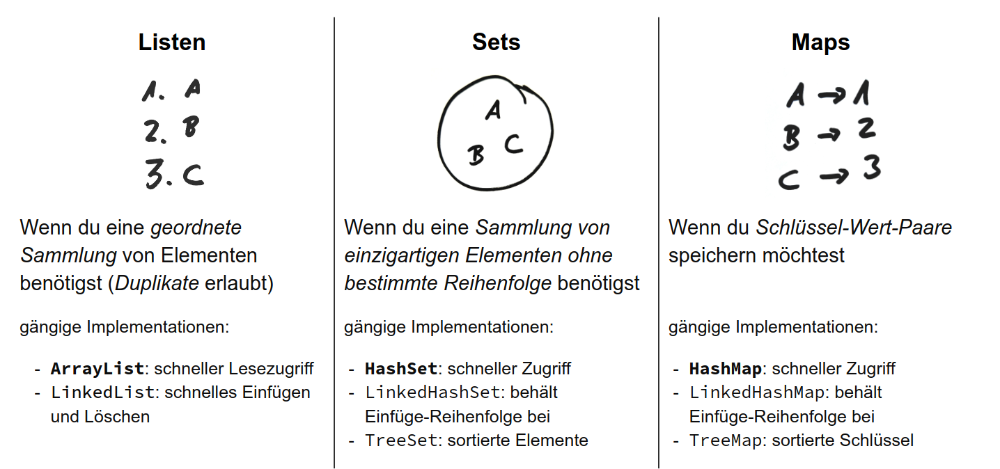

<div style="font-family:Papyrus; font-size:2em;">
    
# Tips & Tricks

## Git Befehle
```bash
git add .
git commit -m "Nachricht"
git push

// 

git pull
```
## switch
```java
switch(expression) {
  case x:
    // code block
    break;
  case y:
    // code block
    break;
  default:
    // code block
}
```

## Collections


### Lists, Sets
```java
Iterator<String> iterator = list.iterator();
while(iterator.hasNext()) {
    System.out.println(iterator.next());
}

for (String s : list) {
    System.out.println(s);
    }
```

### Maps
```java
Map<K, V> map = new HashMap<>();
map.put(K key, V value);
map.get(K key);
Set<K> keys = map.keySet();                  // Menge aller Schluessel
Collection<V> values = map.values();         // Collection aller Werte
Set<Map.Entry<K, V>> entries = map.entrySet();  // Menge aller Schluessel-Werte-Paare
// Iteration ueber alle Eintraege (Map.Entry) der Map
for(Map.Entry<K, V> entry : map.entrySet())
    {
   System.out.println(entry.getKey() + " " + entry.getValue());
    }

```
### Exceptions
```java
//welches Problem könnte auftrefen? -> IllegalSideLength 
public class IllegalSideLengthException extends Exception
{

    public IllegalSideLengthException(String s) {
        super(s);
    }

    public IllegalSideLengthException() {
        super("Sides must be greater than zero!");
    }
}  

//bei welcher Methode/Aktion tritt das Problem auf? 
[modifizierer] [rueckgabetyp] methodenname throws ExceptionType
{
    // Anweisungsblock
    // wirft (evtl.) Exception throw new IllegalSideLengthException();
}   
//wie behandle ich das Problem, wenn ich die Methode benutze?
try {
    // Anweisungsblock
} catch (ExceptionType e) {
    // Behandlung der Exception
}

```

### ENUM
```java
public enum KartenWert {
    SIEBEN(0), ACHT(0), NEUN(0), BUBE(2), DAME(3), KOENIG(4), ZEHN(10), ASS(11);

    private final int wert;

    KartenWert(int wert) {
        this.wert = wert;
    }

    public int getWert() {
        return wert;
    }

}

```
### JUnit-Tests

```java
class PowerTest {
    static Power p1,p2;
    int testnr = 1;

    @BeforeAll
    public static void setup()
    { //given
        p1 = new Power(2,3);
        p2 = new Power(2,3);
    }

    @BeforeEach
    public void printBeforeTests()
    {
        System.out.printf("%n %n --------------- Test %d ------------ %n", testnr);
    }


    @Test
    void testToString() {
        //when
        String s = p1.toString();
        //then
        assertEquals("(2^3)", s, "Strings are not equal!");
    }

    @Test
    public void testEqualsObject() {
        //when
        boolean result = p1.equals(p2); 
        //then
        assertTrue(result, " 2^3 should be equal to 2^3!");
    }
}
```
https://freiheit.f4.htw-berlin.de/prog2/junit/#exceptions-testen
```java
@Test
    void testFakultaetSmallerThan1() 
    {
        // given
        Fakultaet f = new Fakultaet();

        // when
        Exception exception = assertThrows(IllegalArgumentException.class, () ->
        f.fakultaet(0));

        // then
        assertEquals("Zahl muss groesser gleich 1 sein!", exception.getMessage());
    }
```
##### Testideen
* Grenzwerte
* Zahlen: 0, Null (wenn kein Primitiver Datentyp), negative Zahlen, positive Zahlen
* Strings: null, “”, normaler String, String mit Umlauten
* Collections: null, leere Liste/ Map/ Set, Liste mit mehreren Elemeneten (3) anstatt nur einem

### Mockito
```java
Mockito.verify(r, Mockito.times(1)).nextInt(Mockito.anyInt());
Mockito.times(x) //wurde die Methode x mal aufgerufen?
Mockito.atLeast(x)  //wurde die Methode mindestens x mal aufgerufen?
Mockito.atMost(x) //wurde die Methode höchstens x mal aufgerufen?
Mockito.only() // wurde nur diese eine Methode für das Objekt aufgerufen und keine andere?
```

##### Argument Matchers -> Mockito.verify(r, Mockito.times(1)).nextInt(Mockito.anyInt());
* Primitive Typen: anyBoolean(), anyByte(), anyChar() usw.
* Collections: anyCollection(), anyList(), anyMap() usw.
* Strings: anyString(), contains("teilstring"),endsWith("ende"), startsWith("anfang"), matches("Reg. Ausdruck")
* Objekte: any(), isNotNull(), isNull(),isA(EineKlasse.class)


</div>
