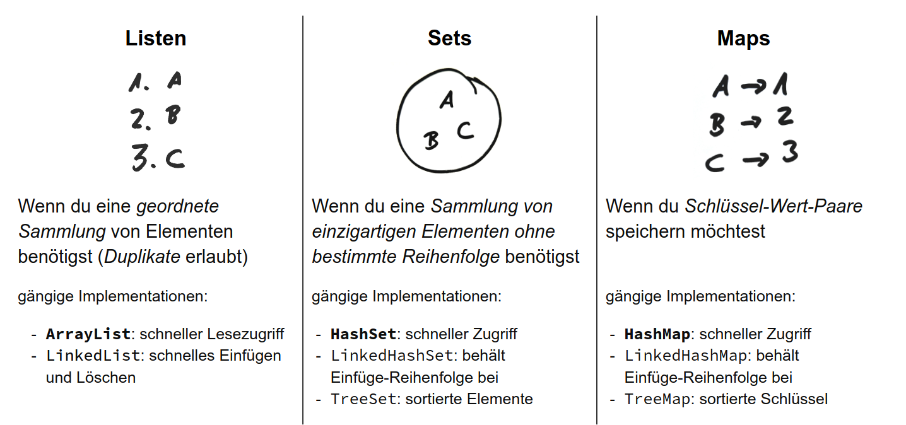

# Tips & Tricks

## Git Befehle
```bash
git add .
git commit -m "Nachricht"
git push

// 

git pull
```

## Collections


###Lists, Sets
```java
Iterator<String> iterator = list.iterator();
while(iterator.hasNext()) {
    System.out.println(iterator.next());
}

for (String s : list) {
    System.out.println(s);
    }
```

###Maps
```java
Map<K, V> map = new HashMap<>();
map.put(K key, V value);
map.get(K key);
Set<K> keys = map.keySet();                  // Menge aller Schluessel
Collection<V> values = map.values();         // Collection aller Werte
Set<Map.Entry<K, V>> entries = map.entrySet();  // Menge aller Schluessel-Werte-Paare
// Iteration ueber alle Eintraege (Map.Entry) der Map
for(Map.Entry<K, V> entry : map.entrySet())
    {
   System.out.println(entry.getKey() + " " + entry.getValue());
    }

```
###Exceptions
```java

public class IllegalSideLengthException extends Exception
{

    public IllegalSideLengthException(String s) {
        super(s);
    }

    public IllegalSideLengthException() {
        super("Sides must be greater than zero!");
    }
}  

[modifizierer] [rueckgabetyp] methodenname throws ExceptionType
{
    // Anweisungsblock
    // wirft (evtl.) Exception throw new IllegalSideLengthException();
}   

try {
    // Anweisungsblock
} catch (ExceptionType e) {
    // Behandlung der Exception
}

```

###ENUM
```java
public enum KartenWert {
    SIEBEN(0), ACHT(0), NEUN(0), BUBE(2), DAME(3), KOENIG(4), ZEHN(10), ASS(11);

    private final int wert;

    KartenWert(int wert) {
        this.wert = wert;
    }

    public int getWert() {
        return wert;
    }

}

```
